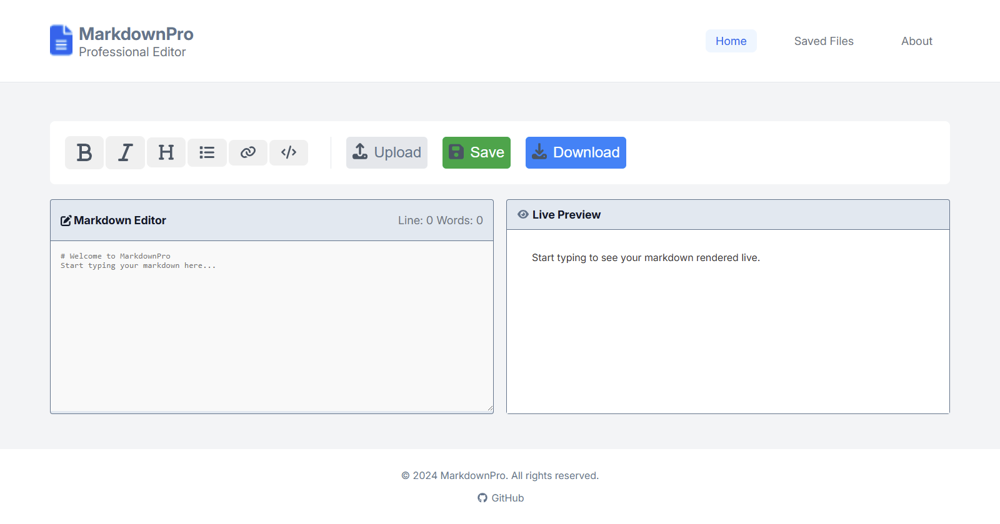
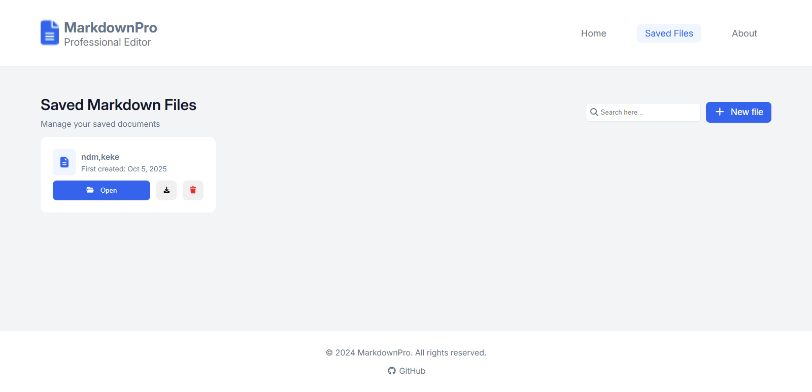
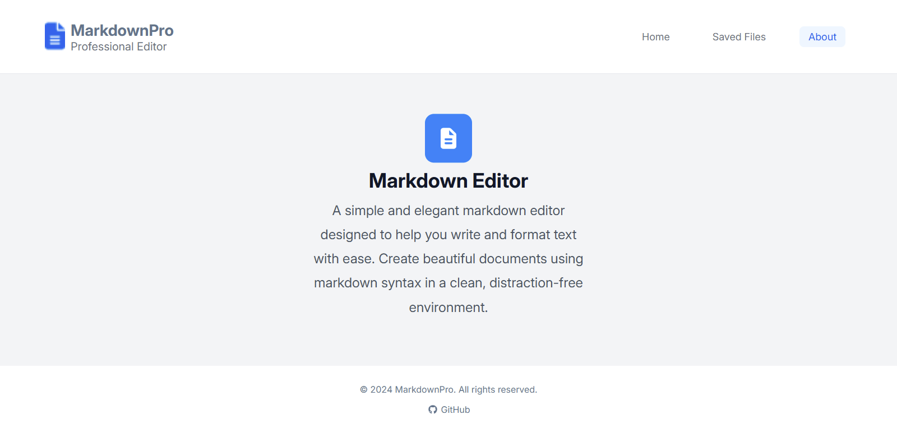

# 📝 MarkdownPro — A Modern Markdown Editor

**MarkdownPro** is a simple, elegant, and accessible markdown editor designed for productivity.  
It features real-time preview, formatting tools, file saving, and local storage — all powered by React and Bun.

---

## 🚀 Features

- 🧠 **Live Markdown Preview** — See your formatted text instantly.
- 💾 **Save, Download, and Manage Files** — Store your notes locally.
- 🎨 **Rich Toolbar** — Bold, italic, headings, lists, links, and code formatting.
- ⚡ **Responsive Success Alerts** — Animated dropdowns for save confirmations.
- 🗂️ **Saved Files Page** — Manage stored markdown files or create new ones.
- ⚙️ **Accessible UI** — Semantic HTML, ARIA labels, and keyboard-friendly controls.
- 🧩 **Error Boundary** — Handles runtime rendering errors gracefully.
- 🌐 **Built with Bun** — Blazing-fast build and runtime performance.

---

## 🛠️ Technology Stack

| Category               | Tools Used                                                     |
| ---------------------- | -------------------------------------------------------------- |
| **Frontend Framework** | React (Functional Components + Context API)                    |
| **Language**           | JavaScript (ES6+)                                              |
| **Styling**            | CSS Modules / BEM Methodology                                  |
| **Markdown Parsing**   | [`react-markdown`](https://github.com/remarkjs/react-markdown) |
| **Icons**              | Font Awesome                                                   |
| **Build Tool**         | [Bun](https://bun.sh)                                          |
| **Routing**            | React Router v6                                                |

---

## 🧩 Architecture Overview

- **Context API** manages state across components for input, preview, and saved files.
- **EditorToolbar**, **Editor**, and **LivePreview** communicate via `DataContext`.
- **Markdown Parsing** is handled client-side using `react-markdown`, providing safe HTML rendering.
- **LocalStorage** persists user-created markdown notes.

---

## 🧰 Installation and Setup

### Prerequisites

Make sure you have **Bun** installed:

```bash
curl -fsSL https://bun.sh/install | bash
```

### Clone the Repository

```bash
git clone https://github.com/opeyemi-code/MarkDown-Previewer.git
cd markdownpro
```

### Install Dependencies

```bash
bun install
```

### Start the Development Server

```bash
bun dev
```

### Build for Production

```bash
bun run build
```

### Preview Production Build

```bash
bun run preview
```

---

## 📜 Available Scripts

| Command           | Description                        |
| ----------------- | ---------------------------------- |
| `bun dev`         | Starts the development server      |
| `bun run build`   | Builds the app for production      |
| `bun run preview` | Serves the built project locally   |
| `bun test`        | Runs project tests (if configured) |

---

## 🖼️ Screenshots

### ✏️ Editor Page

)

### 💾 Saved Files Page



### 💾 About Page



### ⚠️ Error Page


---

## 🧩 Known Issues / Limitations

- No cloud sync or backend API (local-only for now).
- No collaborative editing.
- File uploads are limited to `.md` format.
- Error messages are not persisted across reloads.

---

## 🔮 Future Improvements

- ☁️ Sync markdown notes with cloud storage or a REST API.
- 🪶 Add drag-and-drop file uploads.
- 🧠 Implement autosave functionality.
- 🧩 Add markdown-to-PDF export.
- 💡 Dark/light theme toggle.
- 🔒 User authentication for saved sessions.

---

## 👨‍💻 Author

**Obatola Opeyemi Oluwatosin**  
Frontend Developer | React Enthusiast  
🌍 [GitHub Profile](https://github.com/opeyemi-code)

---

## 📄 License

This project is licensed under the [MIT License](./LICENSE).

---

> “Write beautifully. Preview instantly. Save confidently.”  
> — _MarkdownPro_
